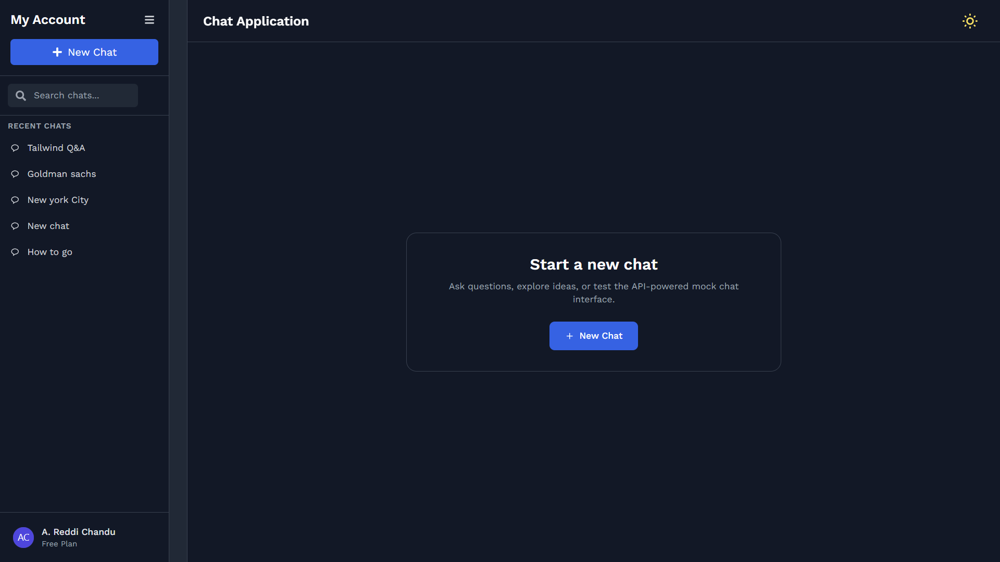

## How the App Works

## Screenshots
### Landing page

### Chat view

### Overall Flow
- The app is split into two parts:
  - **Backend (Node + Express)** – serves mock JSON data.
  - **Frontend (React + Tailwind)** – renders the UI and talks to the backend via REST APIs.

### 1. Landing Page & New Chat
- When you open the app, you see a **“Start a new chat”** card in the main area.
- Clicking **New Chat**:
  - Calls the backend: `GET /api/new-chat`.
  - Backend creates a new session (with a unique id) and returns it.
  - Frontend navigates to `/chat/:sessionId` for that new session.

### 2. Sidebar (Sessions & User Info)
- On load, the sidebar calls `GET /api/sessions`.
- It shows a **list of recent sessions** (titles come from mock data or from the first question you ask).
- When you click a session:
  - Frontend navigates to `/chat/:sessionId`.
  - The main chat window loads that session’s history.
- The bottom of the sidebar shows **user info** (name, plan, avatar).

### 3. Chat Window (Messages + Table)
- [ChatWindow](cci:1://file:///d:/Assessment/frontend/src/components/ChatWindow.js:6:0-96:1) reads the current `sessionId` from the URL.
- On mount or when `sessionId` changes:
  - Calls `GET /api/session/:id` to get previous messages.
  - Renders them as **chat bubbles**.
- When you send a message:
  - The message is added immediately to the UI.
  - Frontend calls `POST /api/chat/:id` with `{ message }`.
  - Backend:
    - Appends the user message to that session’s history.
    - Generates a **mock structured response** using [getTableResponse](cci:1://file:///d:/Assessment/backend/mockData.js:50:0-59:1).
    - Returns:
      - `response` (assistant text)
      - `table` (array of objects)
  - Frontend:
    - Adds the assistant text as a new bubble.
    - Passes the `table` to `TableResponse`, which shows it as a formatted table.

### 4. Answer Feedback
- Below the table, `AnswerFeedback` shows **Like / Dislike** buttons.
- Clicking them just toggles local state (no backend call) and gives visual feedback.

### 5. Theme Toggle (Light / Dark)
- `ThemeToggle` stores the current theme in `localStorage` and syncs it with
  `document.documentElement.classList` (`dark` class).
- All components use Tailwind’s `dark:` classes, so the entire UI switches
  between light and dark modes.

### 6. Responsive Layout
- The app uses Tailwind’s flexbox and responsive utilities.
- **Desktop:**
  - Sidebar fixed on the left, chat on the right.
- **Mobile:**
  - Sidebar collapses and can slide in/out.
  - A menu button in the top bar opens/closes the sidebar.
